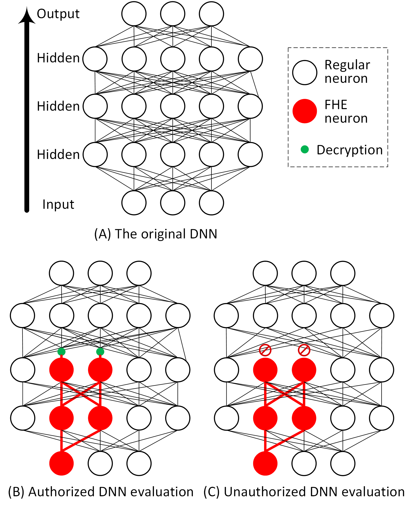

<!-- omit in toc -->
### PrivDNN: A Secure Multi-Party Computation Framework for Deep Learning using Partial DNN Encryption

---
Abstract: In the past decade, we have witnessed an exponential growth of deep learning algorithms, models, platforms, and applications. While existing DL applications and Machine learning as a service (MLaaS) frameworks assume a fully trusted model, the need for privacy-preserving DNN evaluation arises. In a secure multi-party computation scenario, both the model and the dataset are considered proprietary, i.e., the model owner does not want to reveal the highly valuable DL model to the user, while the user does not wish to disclose their private data samples either. Conventional privacy-preserving deep learning solutions ask the users to send encrypted samples to the model owners, who must handle the heavy lifting of ciphertext-domain computation with homomorphic encryption. In this paper, we present a novel solution, namely, PrivDNN, which (1) offloads the computation to the user side by sharing an encrypted deep learning model with them, (2) significantly improves the efficiency of DNN evaluation using partial DNN encryption, (3) ensures model accuracy and model privacy using a core neuron selection and encryption scheme. Experimental results show that PrivDNN reduces privacy-preserving DNN inference time and memory requirement by up to 97% while maintaining model performance and security.




---

<!-- omit in toc -->
### Contents
- [Description](#description)
- [Getting Started](#getting-started)
  - [pre-trained models](#pre-trained-models)
  - [PyTorch environment](#pytorch-environment)
  - [SEAL environment](#seal-environment)
- [Usage](#usage)
  - [train](#train)
  - [test](#test)
  - [select](#select)
  - [recover](#recover)
  - [inference](#inference)
  - [clean](#clean)
  - [others](#others)
- [Citation](#citation)

### Description

This is the official repository of PrivDNN, a framework to accelerate FHE DNN inference by reducing required cipher operations. The repository includes required codes for generating the data in all tables or diagrams in the paper. We fixed the data partition seed as 0 in the dataloader and offered pre-trained models to help repeat our findings in the paper. However, some experiments, such as running time, will have a valid fluctuation and the exact running time depends on the hardware performance.

### Getting Started

We implement PrivDNN using Python 3.10.13, PyTorch 2.1.0, CUDA 12.1, C++ 11.4.0 and CMake 3.26.4. All the experiments are performed on a desktop computer with Ubuntu 22.04 LTS running on AMD Ryzen 7 3700X eight-core CPU, NVIDIA 3090 GPU, and 64 GB memory. To support DNN evaluation in the ciphertext domain, we adopt [Microsoft SEAL](https://github.com/microsoft/SEAL.git) 4.1.1 library.

#### pre-trained models

PrivDNN uses five datasets and corresponding models, i.e., MNIST (LeNet5), EMNIST (LeNet5), GTSRB (AlexNet), CIFAR-10 (VGG16) and Tiny ImageNet (ResNet18). We train all models from scratch and execute experiments based on the well-trained models. The models we use can be found at [Google Drive](https://drive.google.com/drive/folders/15vXR91hg6reWBr-DBrMjz__W5c54w8Nm?usp=sharing).

The model should be put into the corresponding folder as follows.

| Models Name                                     | Folder                              |
|-------------------------------------------------|-----------------------------------|
| MNIST_128_128_100.pth| PrivDNN/saved_models/MNIST        |
 MNIST_128_128_100_cpp.pth | PrivDNN/saved_models/MNIST        |
| EMNIST_128_128_100.pth                          | PrivDNN/saved_models/EMNIST       |
| GTSRB_128_128_100.pth                           | PrivDNN/saved_models/GTSRB        |
| CIFAR10_128_128_100.pth                         | PrivDNN/saved_models/CIFAR10      |
| TinyImageNet_128_128_100.pth                    | PrivDNN/saved_models/TinyImageNet |

#### PyTorch environment

We highly recommend readers to use Conda and pip to manage the PyTorch environments with the following commands:

>conda create --name privdnn python=3.10 && conda activate privdnn  
pip install -r requirements.txt

#### SEAL environment

The SEAL environment configuration is only used for the cipher inference. If readers want to test other functions first, such as selecting critical neurons, readers can pass this step.

The cipher inference may require lots of computing resources and may need a long running time depend on the number of cipher neurons.

Please refer to [Microsft SEAL](https://github.com/microsoft/SEAL/tree/main) for the SEAL environment configuration.

### Usage

PrivDNN offers a script **PrivDNN/bin/run.sh** to facilitate the usage. The script mainly includes six functions: train, test, select, recover, inference and clean. PrivDNN will record all experiments log at the **log** folder named with the running time. The script accepts dataset and function (sub-function) as parameters, and the dataset is not case sensitive.

We briefly introduce those functions as followings. For every function, there are detailed parameters explanation in the script. 

#### train

The *train* function is used to train the model from scratch. We have offered the pre-trained models used for our experiments, so readers can use our models to execute the experiments.  
If readers would like to train the model, such as MNIST (LeNet5) from scratch, readers can use the following commands. But the reader should backup the pre-trained model before training because PrivDNN will automatically continue the training with the default model file name **MNIST_128_128_100.pth."

```
bash run.sh mnist train
```

#### test

The *test* function is used to test the model original accuracy, i.e., $A_o$ in the paper. During the test, we use the top-5-accuracy for Tiny ImageNet and top-1-accuracy for others.

The *test* function's results are used in Table 1.

```
bash run.sh mnist test
```

#### select

*select* is the most important function in PrivDNN. PrivDNN offers four kinds of algorithms to select critical neurons, i.e., random selection, greedy selection, pruning selection, and pruning+greedy selection. All algorithms are listed in **PrivDNN/PrivDNN/main.py**, and readers can configure which algorithm to use here. For datasets MNIST and EMNIST, we select an exact number of neurons in the first two layers; for GTSRB, CIFAR10, and Tiny ImageNet, we select a percentage of neurons in the first two layers. We also explain the parameters in the script.

*select* function's results are used in Tables 2, 3, 4, 5 and Figures 4, 7.

```
bash run.sh mnist select
```

#### recover

*recover* function recovers the model with selected neurons or trains the model from scratch. PrivDNN will use the file **PrivDNN/saved_models/[dataset]/recover_selected_neurons.json** as the selected neurons.

*recover* function's results are used in Table 7 and Figure 7.

```
bash run.sh mnist recover
```

#### inference

*inference* function uses the C++ SEAL library to execute the cipher domain inference. PrivDNN will use the file **PrivDNN/saved_models/[dataset]/inference_encrypted_neurons.json** as the selected neurons. The running time of *inference* function highly depends on the dataset and selected neuron count. During this process, it may take up all CPU cores, generate large cipher files, and consume lots of memory (virtual memory). To test the function, readers can infer the MNIST dataset with selected neurons of {"1": [0], "2": [0]}, which should finish in five minutes.

To execute the inference experiments, readers need to compile the C++ codes to generate related libs.
```
cd seal/src/interact  
mkdid build && cd build  
cmake .. && make -j
```

*inference* function's results are used in Figures 5 and 7.

```
bash run.sh mnist inference
```

#### clean

```
bash run.sh clean
```

*clean* function function deletes the generated cipher parameters. PrivDNN will check if the file exists. If it exists, it will pass the generating process and use it. Otherwise, it will generate the required cipher parameters automatically. If readers change the SEAL parameters, readers must compile and clean encrypted model data to create new data.

#### others

We have some Python programs in **PrivDNN/analyze_result** to statistic the results from previous experiments. The results of those programs are used in Tables 2, 3 and Figures 5, 7.

### Citation
